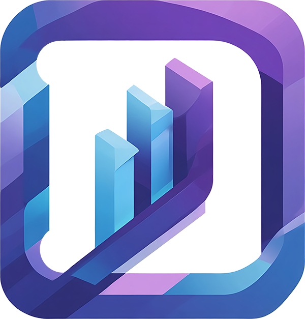

# Domestik

<p align="center">
  
</p>

<p align="center">
  <strong>Professional Service Management for Domestic Workers</strong>
</p>

<p align="center">
  <a href="#features">Features</a> •
  <a href="#demo">Demo</a> •
  <a href="#installation">Installation</a> •
  <a href="#usage">Usage</a> •
  <a href="#tech-stack">Tech Stack</a>
</p>

---

## Overview

**Domestik** is a comprehensive web application designed for domestic service professionals to efficiently manage their clients, track work hours, monitor earnings, and visualize financial performance through intuitive dashboards and analytics.

Built with modern web technologies and a focus on user experience, Domestik helps service providers stay organized and gain valuable insights into their business operations.

## Features

### 📊 Dashboard & Analytics
- **Monthly Overview**: Track earnings, hours worked, and service count for the current month
- **Visual Charts**: Beautiful line charts showing earnings evolution throughout the year
- **Year-over-Year Comparison**: Compare current year performance with previous year
- **Month-over-Month Analysis**: Visualize growth trends with intuitive bar charts

### 👥 Client Management
- **Client Profiles**: Store and manage client information with custom color coding
- **Service History**: Complete record of all services provided to each client
- **Performance Metrics**: View total earnings, hours worked, and service count per client
- **Archive Functionality**: Keep your client list organized by archiving inactive clients

### 📝 Service Tracking
- **Quick Entry**: Easily log new services with date, client, hours worked, and hourly rate
- **Automatic Calculations**: Instant total calculation based on hours and rate
- **Edit & Delete**: Modify or remove entries as needed
- **Filter & Search**: Filter services by date range, client, or value

### 🎨 User Experience
- **Multi-language Support**: Full support for English and Portuguese (PT/EN toggle)
- **Responsive Design**: Optimized for desktop and mobile devices
- **Dark/Light Mode**: Comfortable viewing in any lighting condition
- **Demo Mode**: Try the app with sample data without creating an account

### 🔐 Security & Privacy
- **Secure Authentication**: Powered by Supabase Auth
- **Data Isolation**: Each user only sees their own data
- **Role-based Access**: Admin and viewer permissions

## Demo

Try Domestik instantly with our demo mode! Click the **Demo** button in the header to load the app with sample data showcasing all features.

<p align="center">
  
</p>

## Installation

### Prerequisites
- Node.js 18+ 
- npm or yarn
- Supabase account (for backend)

### Quick Start

1. **Clone the repository**
```bash
git clone https://github.com/Jvagarinho/Domestik.git
cd Domestik
```

2. **Install dependencies**
```bash
npm install
```

3. **Configure environment variables**
Create a `.env` file in the root directory:
```env
VITE_SUPABASE_URL=your_supabase_url
VITE_SUPABASE_ANON_KEY=your_supabase_anon_key
```

4. **Run the development server**
```bash
npm run dev
```

5. **Build for production**
```bash
npm run build
```

## Usage

### Getting Started
1. Create an account or log in
2. Add your first client in the Clients section
3. Start logging services in the Overview page
4. View your analytics in the Charts section

### Navigation
- **Overview**: Dashboard with current month statistics and service history
- **Clients**: Manage your client list and view individual client performance
- **Charts**: Visual analytics showing earnings trends and comparisons

### Demo Mode
Perfect for exploring the app before committing:
- Click the **Demo** button in the header
- Browse all features with realistic sample data
- Toggle demo mode off to return to your real data

## Tech Stack

- **Frontend**: React 19 + TypeScript
- **Build Tool**: Vite 7
- **Styling**: CSS3 with CSS Variables
- **Backend**: Supabase (PostgreSQL + Auth)
- **Charts**: Custom SVG-based charting components
- **Date Handling**: date-fns
- **Icons**: Lucide React
- **State Management**: React Hooks

## Project Structure

```
Domestik/
├── src/
│   ├── components/       # React components
│   ├── hooks/           # Custom React hooks
│   ├── lib/             # Utility functions & demo data
│   ├── types/           # TypeScript type definitions
│   ├── i18n.tsx         # Internationalization
│   └── App.tsx          # Main application
├── public/              # Static assets
└── ...
```

## Contributing

We welcome contributions! Please feel free to submit a Pull Request.

1. Fork the repository
2. Create your feature branch (`git checkout -b feature/AmazingFeature`)
3. Commit your changes (`git commit -m 'Add some AmazingFeature'`)
4. Push to the branch (`git push origin feature/AmazingFeature`)
5. Open a Pull Request

## Roadmap

- [ ] Export data to PDF/Excel
- [ ] Recurring service scheduling
- [ ] Invoice generation
- [ ] Multi-currency support
- [ ] Mobile app (React Native)

## License

This project is licensed under the MIT License.

## Support

For support, email iteriotech@gmail.com or open an issue on GitHub.

---

<p align="center">
  <strong>Built with ❤️ by IterioTech</strong>
</p>

<p align="center">
  <a href="https://iteriotech.com">iteriotech.com</a>
</p>

<p align="center">
  <em>Building the future of application development, one iteration at a time.</em>
</p>
